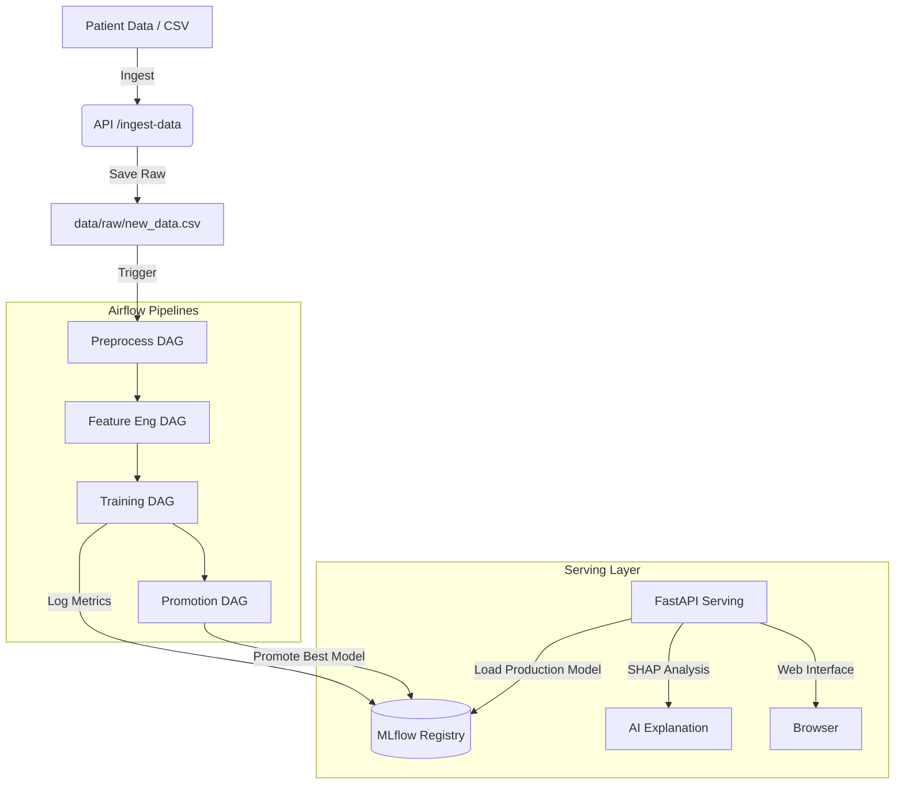

# Lung Cancer Risk Prediction (MLOps Platform)

A production-ready machine learning pipeline for predicting lung cancer risk based on patient survey data. Built with Python, scikit-learn, XGBoost, FastAPI, and orchestrated with Apache Airflow and Docker Compose.

---

## 📋 Table of Contents

- [Overview](#overview)
- [Architecture](#architecture)
- [Project Structure](#project-structure)
- [Quick Start Guide (Docker)](#quick-start-guide-docker)
- [Pipeline Stages & Retraining Workflow](#pipeline-stages--retraining-workflow)
- [API Usage](#api-usage)
- [Model Performance](#model-performance)
- [Dataset Details](#dataset-details)
- [Disclaimer](#disclaimer)

---

## 🎯 Overview

This project implements an end-to-end ML pipeline for lung cancer risk prediction using survey-based patient data. The system includes:

- **Data Pipeline**: Ingestion, validation, preprocessing, and feature engineering.
- **Model Training**: Logistic Regression, Random Forest, and XGBoost with automated hyperparameter tuning.
- **Evaluation**: Comprehensive metrics, ROC/PR curves, threshold optimization.
- **Explainability**: SHAP-based global and local feature importance.
- **API & UI**: FastAPI REST endpoints and a modern Web Dashboard for real-time predictions.
- **Orchestration**: Airflow DAGs for automated retraining.
- **Versioning**: Model registry and experiment tracking via MLflow.

---

## 🏗️ Architecture



---

## 📁 Project Structure

```text
├── airflow/                    # Airflow configurations & DAGs
│   ├── dags/                   # Orchestration workflows (XGBoost, RF, LR)
│   └── plugins/                # Custom operators and hooks
├── api/                        # FastAPI application & Serving logic
│   └── app.py                  # API endpoints (Predict, Explain, Ingest)
├── frontend/                   # Web Interface
│   ├── static/                 # CSS, JS, Icons
│   └── templates/              # HTML Templates
├── src/                        # Core Python Modules
│   ├── data/                   # Ingestion & Preprocessing
│   ├── features/               # Feature Engineering
│   ├── models/                 # Training, Evaluation, SHAP Explanation
│   └── utils/                  # Config, Logger, DB helpers
├── data/                       # Data volume (Raw, Processed, Models)
├── docker-compose.yml          # Full stack orchestration
└── requirements.txt            # Project dependencies
```

---

## 🚀 Quick Start Guide (Docker)

The entire platform is orchestrated with Docker Compose. Please follow these steps carefully to set up your environment.

### 1. Prerequisites

- Docker and Docker Compose installed on your system.
- Git (to clone the repository).

### 2. Environment Setup (.env)

Before running Docker, you must create an environment configuration file. In the root directory of the project (where `docker-compose.yml` is located), create a file named `.env` and add the following configuration:

```env
# Airflow settings
AIRFLOW_UID=50000
AIRFLOW_PROJ_DIR=.

# Database credentials
POSTGRES_USER=postgres
POSTGRES_PASSWORD=123456
POSTGRES_DB=lung_cancer_db

# Host mapping for training
HOST_TRAINING_DIR=/tmp
```

### 3. Launch the Stack

Once the `.env` file is ready, open your terminal, navigate to the project root, and run:

```bash
# Build the images and start all containers in detached mode
docker-compose up -d --build
```

*Note: The first launch will take a few minutes as Docker downloads the necessary images, initializes the PostgreSQL database, and sets up Airflow metadata.*

### 4. Access the Services

After the containers report as `healthy`, you can access the following services in your web browser:

- **Main Application (Web Dashboard & API)**: http://localhost:8000
- **Airflow UI (Workflow Management)**: http://localhost:8080
  - Default login: Username: `airflow` / Password: `airflow`
- **MLflow Tracking Server**: http://localhost:5001
- **pgAdmin (Database Management)**: http://localhost:8082
  - Default login: Email: `admin@admin.com` / Password: `admin`

### 5. Useful Docker Commands

To view the real-time logs of the serving API (useful for seeing predictions and SHAP outputs):
```bash
docker logs model-serving -f
```

To stop all services gracefully:
```bash
docker-compose down
```

To completely reset the environment (WARNING: this removes the database and all tracked models):
```bash
docker-compose down -v
```

---

## 🔄 Pipeline Stages & Retraining Workflow

The system is designed to continuously learn from new data.

### How to trigger a retrain:
1. **Ingest Data**: Go to the **Data Ingestion** tab in the Web Dashboard (http://localhost:8000). Enter patient data manually (ensure you select the actual diagnosis label) or upload a CSV file containing the `lung_cancer_risk` column.
2. **Open Airflow**: Navigate to the Airflow UI (http://localhost:8080).
3. **Trigger Pipeline**: Manually trigger the `ingest_new_data_to_db` DAG. 
4. **Cascade Execution**: This will automatically trigger the subsequent pipelines:
   `ingest_new_data_to_db` → `preprocess_data` → `build_features` → `train_models` → `evaluate_and_promote`
5. **Deployment**: Once complete, MLflow promotes the model with the highest **Recall** score. The Serving API automatically begins using this new model for future predictions.

---

## 📊 API Usage

If you prefer to interact with the system programmatically, you can use the REST API.

| Method | Endpoint | Description |
|--------|----------|-------------|
| `GET` | `/` | Serves the Web UI |
| `GET` | `/health` | Detailed health status of the API and Model |
| `POST` | `/predict` | Submit a JSON payload of 29 features to get a prediction and SHAP explanation |
| `POST` | `/ingest-data` | Submit an array of records (with labels) to be saved for retraining |
| `POST` | `/upload-csv` | Upload a batch CSV file for retraining |

---

## 📈 Model Performance

Models are evaluated using multiple metrics, but **Recall is prioritized** to minimize false negatives (missed cancer diagnoses).

Evaluation outputs (viewable in the MLflow UI) include:
- Confusion matrix heatmap
- ROC curve
- Precision-Recall curve
- Threshold analysis plot
- SHAP feature importance

---

## 📝 Dataset Details

Based on the [Kaggle Lung Cancer Prediction Dataset](https://www.kaggle.com/datasets/dhrubangtalukdar/lung-cancer-prediction-dataset) with 30 features:

| Variable | Description |
|---|---|
| age | Age of the individual in years |
| gender | 0 = Female, 1 = Male |
| education_years | Total years of formal education |
| income_level | 1 = lowest, 5 = highest |
| smoker | 0 = No, 1 = Yes |
| smoking_years | Total number of years smoked |
| cigarettes_per_day | Average cigarettes per day |
| pack_years | Cumulative smoking exposure |
| passive_smoking | Exposure to secondhand smoke (0/1) |
| air_pollution_index | Air quality exposure index |
| occupational_exposure | Hazardous substance exposure at work (0/1) |
| radon_exposure | History of radon exposure (0/1) |
| family_history_cancer | Family history of cancer (0/1) |
| copd | Diagnosis of COPD (0/1) |
| asthma | History of asthma (0/1) |
| previous_tb | History of tuberculosis (0/1) |
| chronic_cough | Long-term cough symptoms (0/1) |
| chest_pain | Reports of chest pain (0/1) |
| shortness_of_breath | Breathing difficulty (0/1) |
| fatigue | Persistent fatigue symptoms (0/1) |
| bmi | Body mass index |
| oxygen_saturation | Blood oxygen saturation level (%) |
| fev1_x10 | Lung function measure (FEV1) |
| crp_level | C-reactive protein level (inflammation) |
| xray_abnormal | Abnormal imaging findings (0/1) |
| exercise_hours_per_week | Weekly physical activity duration |
| diet_quality | Overall dietary quality (1-5) |
| alcohol_units_per_week | Average alcohol consumption per week |
| healthcare_access | Access to healthcare services (1-5) |
| lung_cancer_risk | **Target** (0 = No, 1 = Yes) |

---

## ⚠️ Disclaimer

This project is for **educational and research purposes only**. It should **not** be used for clinical decision-making or as a substitute for professional medical advice.

---

## 📄 License

MIT License
